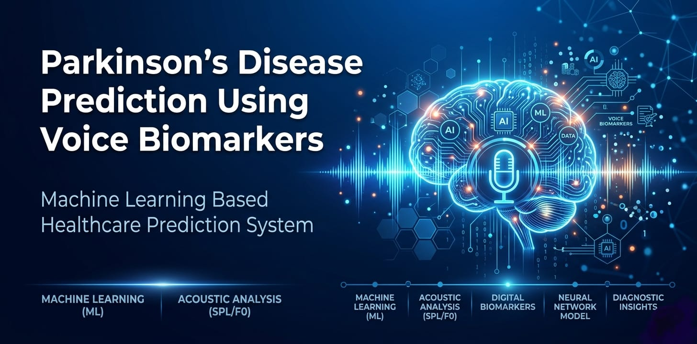
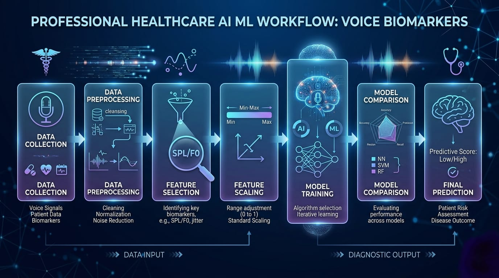
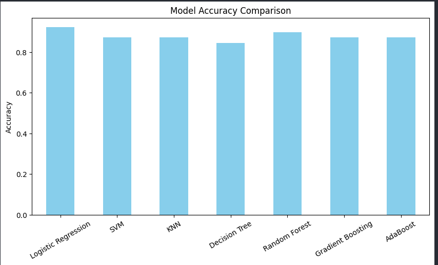
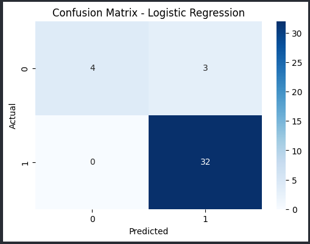
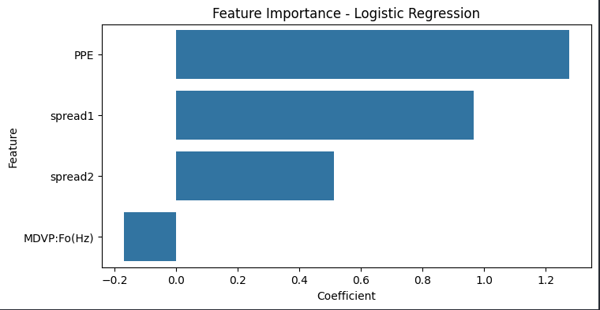

<p align="center">
  
</p>

<h1 align="center">
Parkinson’s Disease Prediction Using Voice Biomarkers
</h1>

<p align="center">
AI-powered Parkinson’s Disease Detection using Machine Learning and Vocal Biomarkers
</p>

<p align="center">
  
  
  
  
</p>

<p align="center">
  
  
  
  
</p>

<p align="center">
  
  
  
</p>

## Table of Contents

- [Overview](#overview)
- [Key Highlights](#key-highlights)
- [Problem Statement](#problem-statement)
- [Dataset](#dataset)
- [Machine Learning Workflow](#machine-learning-workflow)
- [Tech Stack](#tech-stack)
- [Model Comparison](#model-comparison)
- [Results and Insights](#results-and-insights)
- [Confusion Matrix](#confusion-matrix)
- [Feature Importance](#feature-importance)
- [Final Model Performance](#final-model-performance)
- [Project Structure](#project-structure)
- [Future Scope](#future-scope)
- [Installation](#installation)
- [Usage](#usage)
- [Author](#author)


## Overview

This project focuses on predicting Parkinson’s disease using voice biomarker features and machine learning algorithms.

The system analyzes biomedical voice measurements and classifies whether a person is likely to have Parkinson’s disease.

Multiple machine learning models were trained and compared to identify the best-performing classifier.

## Key Highlights

<div align="center">

<table>

<tr>
<td> Achieved 89.74% Test Accuracy</td>
<td> Compared 7 ML Models</td>
</tr>

<tr>
<td> Feature Selection Pipeline</td>
<td> Hyperparameter Tuning</td>
</tr>

<tr>
<td> Logistic Regression Final Model</td>
<td> Prediction Visualization & Analysis</td>
</tr>

</table>

</div>

## Problem Statement

Parkinson’s disease affects speech patterns and vocal stability.

Early diagnosis is important but can sometimes be difficult and time-consuming.

This project explores how machine learning can assist in early prediction using voice-based biomedical features.

## Dataset

The dataset contains biomedical voice measurements collected from individuals with and without Parkinson’s disease.

### Selected Features

- spread1
- spread2
- PPE
- MDVP:Fo(Hz)

### Dataset Preview

<p align="center">
  
</p>

## Machine Learning Workflow

<p align="center">
  
</p>


## Tech Stack

<div align="center">

<table>

<tr>
<td align="center" width="120">


<br>

<b>Python</b>

</td>

<td align="center" width="120">


<br>

<b>Pandas</b>

</td>

<td align="center" width="120">


<br>

<b>NumPy</b>

</td>

<td align="center" width="120">


<br>

<b>Scikit-Learn</b>

</td>

</tr>

<tr>

<td align="center" width="120">


<br>

<b>Matplotlib</b>

</td>

<td align="center" width="120">


<br>

<b>Seaborn</b>

</td>

<td align="center" width="120">


<br>

<b>Jupyter</b>

</td>

<td align="center" width="120">


<br>

<b>Git</b>

</td>

</tr>

</table>

</div>

## Model Comparison

Multiple machine learning algorithms were trained and evaluated.

### Models Used

- Logistic Regression
- SVM
- KNN
- Decision Tree
- Random Forest
- Gradient Boosting
- AdaBoost

### Accuracy Comparison

<p align="center">
  
</p>

## Results and Insights

The machine learning models were evaluated using testing accuracy, cross-validation accuracy, classification reports, and confusion matrix analysis.

Among all evaluated algorithms, Logistic Regression achieved the best overall performance for this dataset.

### Key Findings

- Logistic Regression produced the highest testing accuracy of **89.74%**
- Cross-validation accuracy reached **85.22%**, indicating stable model generalization
- The model successfully identified most Parkinson’s positive cases with high sensitivity
- Feature scaling significantly improved model performance and stability
- Vocal biomarker features such as `spread1`, `PPE`, and `spread2` showed strong influence on prediction outcomes

### Model Behavior Analysis

The confusion matrix analysis showed:

- High True Positive predictions
- Zero False Negative cases
- Strong detection capability for Parkinson’s positive samples

However, the model showed lower specificity for negative class prediction due to dataset imbalance.

### Overall Insight

The project demonstrates that machine learning techniques can effectively analyze vocal biomarker patterns for Parkinson’s disease prediction.

The final system provides a strong foundation for future real-time AI-assisted healthcare applications using speech analysis.


## Confusion Matrix

The confusion matrix shows prediction performance on the testing dataset.

<p align="center">
  
</p>

## Feature Importance

The Logistic Regression model identified the most influential vocal biomarkers affecting prediction performance.

<p align="center">
  
</p>

## Final Model Performance

<div align="center">

<table>

<tr>
<th>Metric</th>
<th>Result</th>
</tr>

<tr>
<td><b>Test Accuracy</b></td>
<td>


</td>
</tr>

<tr>
<td><b>Cross Validation Accuracy</b></td>
<td>


</td>
</tr>

<tr>
<td><b>Best Model</b></td>
<td>


</td>
</tr>

</table>

</div>

## Project Structure

```bash
parkinsons-voice-project/
│
├── data/
│   └── selected_features.csv
│
├── notebooks/
│   ├── 01_EDA.ipynb
│   ├── 02_Feature_Selection.ipynb
│   ├── 03_Baseline_Model.ipynb
│   ├── 04_Model_Comparison.ipynb
│   └── 05_Final_Model.ipynb
│
├── models/
│   └── final_logistic_model.pkl
│
├── results/
│   ├── final_predictions.csv
│   └── model_comparison_results.csv
│
├── assets/
│   ├── banner.png
│   ├── workflow.png
│   ├── confusion_matrix.png
│   ├── feature_importance.png
│   └── model_comparison.png
│
├── README.md
├── requirements.txt
└── app.py
```

---

## Future Scope

Future enhancements can significantly improve the practical usability and scalability of this system.

Possible future developments include:

- Real-time microphone-based voice input
- Automatic audio feature extraction pipeline
- Deep learning model integration
- Mobile and web application deployment
- Cloud-based prediction system
- Large-scale medical dataset training
- Real-world clinical testing and validation
- AI-assisted healthcare monitoring system
- Continuous learning using new voice samples
- Multi-language voice analysis support

The current project provides a strong foundation for developing an intelligent AI-powered healthcare prediction platform.


## Installation

Clone the repository:

```bash
git clone https://github.com/Rumana918/parkinsons-voice
```

Navigate to the project directory:

```bash
cd parkinsons-voice
```

Install dependencies:

```bash
pip install -r requirements.txt
```


---

## Usage

Run the Jupyter notebooks sequentially for:

- data preprocessing
- model training
- model comparison
- final prediction

## Author

Rumana Parven

Machine Learning & Data Science Enthusiast

---


<div align="center">


</div>
